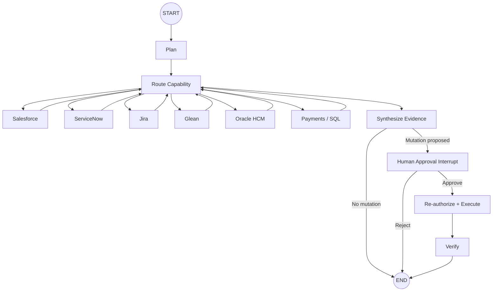

# Architecture

## Initiative

Establish a governed enterprise agentic platform that enables AI-driven workflows to securely discover information, reason across enterprise context, and coordinate approved actions across systems such as Salesforce, ServiceNow, Jira, Glean, Oracle HCM, and internal data services.

## Responsibility model

```text
Experience       React / TypeScript
Control          FastAPI
Orchestration    LangGraph
Inference        Amazon Bedrock
Knowledge        Glean / RAG
Structured data  Governed SQL / repositories
Operations       Salesforce / ServiceNow / Jira / Oracle HCM / internal APIs
Governance       Identity / authorization / tenant isolation / approvals / audit
Operations       OpenTelemetry / logs / metrics / CI/CD / evaluations
```

## Trust boundary

The model is never the authorization authority.

```text
Authenticated identity
        ↓
Trusted ExecutionContext
        ↓
LangGraph asks for a capability
        ↓
Policy decision
        ↓
Governed adapter/repository
        ↓
Enterprise system
        ↓
Authorized evidence
        ↓
Bedrock reasoning
```

`tenant_id`, service credentials and entitlements are not model arguments.

## Runtime objects

### ExecutionContext

Immutable run-scoped security context:

```text
user_id
 tenant_id
 roles
 workflow_id
 trace_id
```

### WorkflowState

Mutable business/workflow state:

```text
request
subject
selected capabilities
evidence
errors
analysis
proposed action
approval state
final answer
```

Keeping them separate prevents the model from rewriting trusted identity attributes.

## Graph



The reference implementation intentionally executes read capabilities serially for traceability. Production can fan out independent read nodes in parallel once timeout, authorization and failure semantics are defined.

## Knowledge and data access

| Information type | Preferred mechanism | Governance |
|---|---|---|
| Product/runbook knowledge | Glean or RAG | source ACLs + metadata/policy filters |
| Structured transactions | repository / constrained SQL | parameterization + tenant predicate + DB permissions |
| Customer context | Salesforce capability | OAuth/service identity + app policy |
| Incidents | ServiceNow capability | narrow read/write scopes + approval for mutations |
| Engineering work | Jira capability | narrow API contracts + project authorization |
| Organizational ownership | Oracle HCM capability | minimal fields + role/attribute policy |

## Model contract

Bedrock returns typed outputs, not executable authority.

Planning contract:

```json
{
  "capabilities": ["salesforce", "payments", "jira"],
  "rationale": "..."
}
```

Analysis contract:

```json
{
  "summary": "...",
  "supporting_references": ["INC-9821", "PAY-451"],
  "proposed_action": null
}
```

When a mutation is proposed, the graph pauses before execution.

## Mutation safety

Mutations require:

1. typed model proposal;
2. deterministic policy validation;
3. human approval when required;
4. re-authorization immediately before execution;
5. idempotency key;
6. post-action verification;
7. audit telemetry.

## Persistence

Local development uses an in-memory checkpointer. Production should use a durable LangGraph checkpointer such as PostgreSQL and encrypt/minimize state. The workflow registry must bind `workflow_id` to the owning tenant so another tenant cannot resume it.

## Observability

Recommended span hierarchy:

```text
investigation
  ├─ auth
  ├─ plan
  ├─ capability.salesforce
  ├─ capability.payments
  ├─ capability.servicenow
  ├─ synthesize
  ├─ approval
  ├─ mutation.servicenow
  └─ verify
```

Do not record secrets, access tokens, raw HR profiles, full document bodies or unrestricted SQL results in telemetry.
