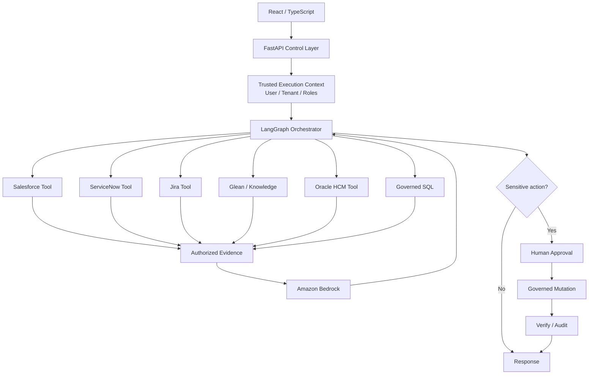

# Governed Enterprise Agentic Platform

A production-shaped reference monorepo for building **governed, multi-tenant agentic workflows** across enterprise systems.

The platform separates probabilistic AI reasoning from deterministic security and execution controls:

- **React / TypeScript** — user experience and approval UI.
- **FastAPI / Python** — API boundary, identity context, tenant context, request validation.
- **LangGraph** — stateful workflow orchestration, routing, checkpointing, pause/resume.
- **AWS Bedrock** — model inference and structured outputs.
- **Governed tools** — Salesforce, ServiceNow, Jira, Glean, Oracle HCM, SQL/data services.
- **Policy layer** — deterministic authorization before every enterprise capability.
- **OpenTelemetry-ready observability** — workflow, tool, latency, policy and action telemetry.
- **CI/CD** — unit, integration, security and tenant-isolation checks.

> Core principle: **The agent determines what capability it needs; deterministic application controls determine what it is permitted to access and execute.**

## Architecture



See [ARCHITECTURE.md](ARCHITECTURE.md) for the detailed control and runtime model.

## Repository layout

```text
.
├── apps/
│   ├── api/                    # FastAPI + LangGraph + Bedrock orchestration
│   └── web/                    # React/TypeScript investigation + approval UI
├── services/
│   └── enterprise-tools/       # TypeScript governed enterprise adapter service
├── infra/
│   └── terraform/              # AWS deployment foundation
├── scripts/                    # local demo helpers
├── .github/workflows/          # CI pipeline
├── ARCHITECTURE.md
├── SECURITY.md
└── docker-compose.yml
```

## What the reference workflow does

A user can ask something like:

> Why are payments failing for customer-123, are there active incidents, and do we need to open a new incident?

The workflow can:

1. Authenticate the caller and establish a trusted tenant/user context.
2. Ask Bedrock for a **typed investigation plan**.
3. Invoke only the required governed capabilities.
4. Re-authorize each tool call using deterministic code.
5. Retrieve evidence from CRM, ITSM, Jira, enterprise knowledge, HCM ownership and structured payment data.
6. Ask Bedrock to synthesize the authorized evidence.
7. Pause the graph if a sensitive action is proposed.
8. Resume after a human approval/rejection.
9. Re-authorize the mutation, execute it with an idempotency key, verify it and audit the result.

## Local quick start — mock mode

Mock mode requires no AWS or enterprise credentials.

### Enterprise tool service

```bash
cd services/enterprise-tools
npm install
npm run dev
```

### Backend

```bash
cd apps/api
python -m venv .venv
source .venv/bin/activate       # Windows: .venv\\Scripts\\activate
pip install -e '.[dev]'
uvicorn agentic_platform.main:app --reload --port 8000
```

The default configuration uses `APP_MODE=mock` for model inference, while enterprise capability calls still cross the TypeScript adapter boundary.

### Frontend

```bash
cd apps/web
npm install
npm run dev
```

Open `http://localhost:5173`.

### Docker Compose

```bash
docker compose up --build
```

The compose stack starts PostgreSQL, the Python API, the TypeScript enterprise-tool service and the React web app.

## Bedrock mode

Set:

```bash
APP_MODE=bedrock
AWS_REGION=us-east-1
BEDROCK_MODEL_ID=<approved-bedrock-model-or-inference-profile>
```

Use an IAM role in deployed environments; do not store static AWS credentials in the repo.

## Authentication

The repository includes a **demo header authenticator** so the control flow can be exercised locally:

```text
X-User-Id: jose
X-Tenant-Id: ACME
X-Roles: analyst,ops_manager
```

Production deployments must replace it with validated OIDC/JWT identity and resolve tenant/entitlements from a trusted identity or policy source.

The request body deliberately contains **no `tenant_id` field**.

## API example

```bash
curl -X POST http://localhost:8000/v1/investigations \
  -H 'Content-Type: application/json' \
  -H 'X-User-Id: jose' \
  -H 'X-Tenant-Id: ACME' \
  -H 'X-Roles: analyst,ops_manager' \
  -d '{
    "question":"Why are payments failing and do we need a new incident?",
    "subject":"customer-123"
  }'
```

To deliberately exercise the human-approval path in mock mode, use a request such as `"Create a new incident for the payment failure"`.

If the graph returns `awaiting_approval`:

```bash
curl -X POST http://localhost:8000/v1/investigations/<workflow_id>/resume \
  -H 'Content-Type: application/json' \
  -H 'X-User-Id: jose' \
  -H 'X-Tenant-Id: ACME' \
  -H 'X-Roles: ops_manager' \
  -d '{"approved":true,"comment":"Proceed"}'
```

## Development commands

```bash
make test
make lint
make api
make tools
make web
```

## CI/CD

The repository includes:

- `ci.yml` — Python lint/tests plus TypeScript builds.
- `security.yml` — CodeQL and filesystem vulnerability scanning.
- `deploy-example.yml` — OIDC-based AWS/ECR build-and-push skeleton with environment gates.

The deployment workflow deliberately stops at the environment-specific handoff rather than inventing an ECS/VPC topology for your organization.

## Production hardening backlog

The repository intentionally draws clear extension points for the work a production team would complete:

- Replace demo headers with enterprise OIDC/JWT validation.
- Replace in-memory workflow ownership with a durable tenant-aware workflow registry.
- Use LangGraph PostgreSQL checkpointing for durable pause/resume.
- Integrate Amazon Verified Permissions/Cedar or the enterprise PDP.
- Replace mock adapters with vendor OAuth/service identities and narrow capability contracts.
- Add OpenTelemetry exporters and trace redaction policies.
- Add Bedrock Guardrails where appropriate for model input/output safety.
- Add workload-specific rate limits, retries, circuit breakers and SLOs.
- Add full data-classification rules for RAG/Glean/Oracle HCM responses.
- Add deployment-specific IAM, networking, encryption and secret rotation.

## Why this is not “just RAG”

RAG is one governed knowledge-access mechanism. The graph may also use SQL, enterprise search and operational APIs. LangGraph coordinates them; Bedrock reasons over the evidence; deterministic services enforce access.
